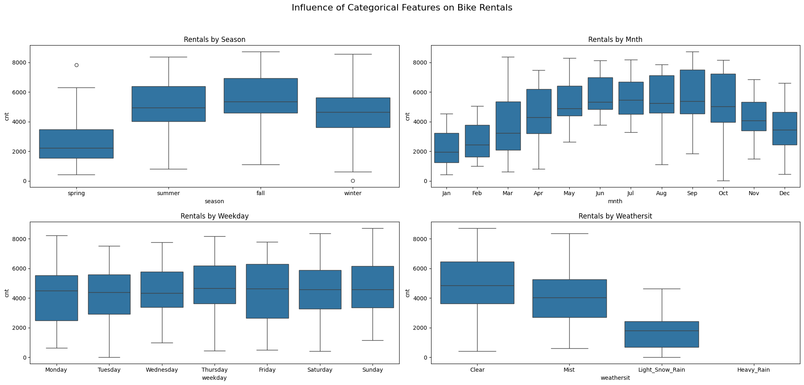

# Bike Rental Demand Forecasting using Linear Regression

## Overview

This project develops a multiple linear regression model to predict daily demand for shared bikes for BoomBikes, a US bike-sharing provider. The primary goal is to identify the key factors influencing bike rentals to help the company devise effective strategies for business growth, particularly in the post-pandemic era. By understanding the drivers of demand, BoomBikes can optimize its operations, marketing efforts, and overall business strategy.

## Problem Statement

BoomBikes has faced a significant decline in revenue due to the COVID-19 pandemic. To ensure a strong recovery, the company aims to understand the factors that drive the demand for their bike-sharing service in the American market. This project addresses the following key questions:

*   Which variables are significant in predicting the demand for shared bikes?
*   How well do these variables explain the variance in bike demand?

The insights from this model will empower BoomBikes to make data-driven decisions to meet customer demand and enhance profitability.

## Data

The analysis is based on the `day.csv` dataset, which contains daily bike rental data. Key features include:

-   **Temporal Variables**: `dteday`, `season`, `yr`, `mnth`, `holiday`, `weekday`, `workingday`
-   **Weather Variables**: `weathersit`, `temp`, `atemp`, `hum`, `windspeed`
-   **Target Variable**: `cnt` (total daily bike rentals)

A comprehensive data dictionary is available in `data_dictionary.txt`.

## Project Workflow

The project followed a structured approach to ensure a robust and reliable model:

1.  **Data Loading and Inspection**: Initial examination of the dataset's structure, data types, and for missing values.
2.  **Data Preparation**:
    *   Mapped categorical variables to their string representations for better interpretability.
    *   Converted `dteday` to a datetime format to extract month and day of the week.
    *   Dropped redundant columns (`instant`, `casual`, `registered`) to prevent data leakage and multicollinearity.
    *   Handled outliers in `windspeed` and `hum` using IQR capping.
3.  **Exploratory Data Analysis (EDA)**:
    *   Analyzed the distribution of the target variable (`cnt`) and other numerical and categorical features.
    *   Conducted time-series analysis to identify trends in bike rental demand.
    *   Used bivariate and multivariate analysis to explore relationships between variables.
4.  **Model Building**:
    *   Created dummy variables for categorical features.
    *   Split the data into training (80%) and testing (20%) sets.
    *   Scaled numerical features using `StandardScaler`.
    *   Employed Recursive Feature Elimination (RFE) to select the most impactful features.
    *   Built an OLS (Ordinary Least Squares) regression model and iteratively refined it by analyzing p-values and VIF (Variance Inflation Factor) scores.
5.  **Model Evaluation**:
    *   Assessed the model's performance on the test set using the R-squared value.
    *   Validated the assumptions of linear regression: Linearity, Independence, Normality, and Homoscedasticity.

## Visual Insights from Exploratory Data Analysis

Visualizations from the EDA phase reveal key patterns in bike rental demand.

**1. Daily and Monthly Trends**
The time-series plots illustrate the overall trend in bike rentals over the two-year period. The daily plot, along with a 30-day moving average, smooths out daily noise to show the underlying seasonal pattern and a noticeable year-over-year growth in demand. The monthly trend plot confirms the cyclical nature of demand, peaking during warmer months.

**2. Rental Distribution by Month and Season**
This plot provides a more detailed view of the interaction between month and season. We can see a clear progression of demand, starting low in the spring months, rising through the summer, peaking in the fall, and declining in the winter.

**3. Influence of Categorical Features**
The boxplots below show how bike rentals vary across different categorical variables. It's clear that demand is highest in the **fall** and **summer**, and drops significantly during **light snow/rain**. Weekday usage remains relatively consistent.

## Key Findings and Model Performance

The final linear regression model provides significant insights into the factors driving bike rental demand.

### Model Performance

*   **Training R-squared**: 83.0%
*   **Test R-squared**: 78.0%

The model explains 78% of the variance in bike rental demand on unseen data, indicating a strong predictive capability. The close alignment of the training and test R-squared values suggests that the model generalizes well and is not over-fitting.

### Top 3 Predictor Variables

The following features were identified as the most significant predictors of bike rental demand:

1.  **Year (`yr`)**: The model shows a strong positive correlation with the year, indicating a growth in bike-sharing popularity over time. This is the most significant feature in the model.
2.  **Temperature (`temp`)**: Higher temperatures are associated with a significant increase in bike rentals. This highlights the impact of favorable weather on demand.
3.  **Weather Situation (`weathersit`)**:
    *   **Light Snow/Rain**: This condition has a strong negative impact on bike rentals, leading to a substantial decrease in demand.
    *   **Mist**: Misty conditions also negatively affect the number of rentals, though to a lesser extent than snow or rain.

### Other Significant Factors

*   **Seasons**:
    *   **Winter**: Surprisingly, after accounting for other factors, the model indicates a positive association with winter. This could be due to the way seasons are defined in the dataset or other confounding variables.
    *   **Summer and Fall**: Both seasons show a positive correlation with bike rentals compared to spring (the baseline).
*   **Holidays**: Demand tends to be lower on holidays.
*   **Months**: Certain months like September show a significant positive impact on demand.

## Business Recommendations

Based on the model's findings, here are some actionable recommendations for BoomBikes:

1.  **Leverage Seasonal and Weather Trends**:
    *   Promote bike rentals heavily during periods of good weather and in the summer and fall seasons.
    *   Offer promotions or discounts on days with light snow or rain to encourage usage.
    *   Develop marketing campaigns that highlight the benefits of cycling in different weather conditions.

2.  **Capitalize on Growth Trends**:
    *   The positive trend in `yr` suggests a growing market. BoomBikes should continue to invest in expanding their fleet and services.

3.  **Optimize Operations for Non-Holidays**:
    *   Since demand is higher on working days, ensure a higher availability of bikes in key business and commuter areas.

4.  **Targeted Monthly Campaigns**:
    *   Launch special marketing initiatives during high-demand months like September to maximize revenue.

## Repository Contents

-   `bike_rental_regression_analysis.ipynb`: The Jupyter Notebook containing the complete analysis and model-building process.
-   `day.csv`: The dataset used for this project.
-   `data_dictionary.txt`: A detailed description of the dataset features.
-   `visualizations/`: A folder containing key plots from the analysis.
-   `README.md`: This file, providing an overview of the project.

## Libraries and Tools Used

-   pandas
-   numpy
-   matplotlib
-   seaborn
-   scikit-learn
-   statsmodels

## Author

-   **Sachin Kanchan** - [GitHub Profile](https://github.com/sachin-kanchan)

## License

This project is licensed under the MIT License. See the `LICENSE` file for details.